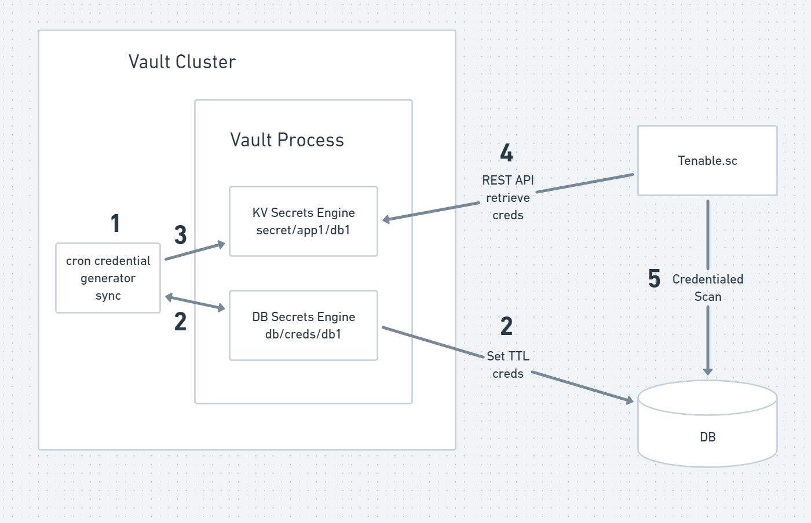

# vault-dyn2kv-sync
POC script that syncs Vault dynamic creds to KV paths, so the Tenable integration with Vault can leverage dynamic creds without requiring Tenable updates. Allows easier migration from static to dynamic credentials.



## Vault KV Setup

Enable KV secrets engine and put a static secret in.
```
vault secrets enable -version=2 secret
vault kv put secret/app1/db1 username=foo password=bar
```

```
$ vault kv get secret/app1/db1
====== Metadata ======
Key              Value
---              -----
created_time     2021-04-25T02:09:43.5074973Z
deletion_time    n/a
destroyed        false
version          4

====== Data ======
Key         Value
---         -----
password    bar
username    foo
```

## DB Setup

Using the Mysql plugin with the database secrets engine in this example.

```
mysql -uroot -proot <<EOF
DROP DATABASE IF EXISTS db1;
CREATE DATABASE db1;

use mysql;
DROP USER 'vault'@'%';
CREATE USER 'vault'@'%' IDENTIFIED BY 'vaultpass';
GRANT SUPER ON *.* to 'vault'@'%' WITH GRANT OPTION;
FLUSH PRIVILEGES;
EOF

echo "Creating db1 database"
mysql -uroot -proot <<EOF
create database if not exists db1;
USE db1;
CREATE TABLE IF NOT EXISTS tasks (
    task_id INT AUTO_INCREMENT,
    title VARCHAR(255) NOT NULL,
    start_date DATE,
    due_date DATE,
    status TINYINT NOT NULL,
    priority TINYINT NOT NULL,
    description TEXT,
    PRIMARY KEY (task_id)
)  ENGINE=INNODB;
CREATE TABLE IF NOT EXISTS users (
    task_id INT AUTO_INCREMENT,
    title VARCHAR(255) NOT NULL,
    start_date DATE,
    due_date DATE,
    status TINYINT NOT NULL,
    priority TINYINT NOT NULL,
    description TEXT,
    PRIMARY KEY (task_id)
)  ENGINE=INNODB;

```

## Vault DB secrets engine setup

Enable DB secrets engine, configure a role, and configure a policy.
```
echo "Enabling database secrets engine"
vault secrets enable database

echo "Writing db1 DB secrets engine config"
vault write database/config/db1 \
    plugin_name=mysql-database-plugin \
    connection_url="{{username}}:{{password}}@tcp(127.0.0.1:3306)/" \
    allowed_roles="db1-5s,db1-30s" \
    username="root" \
    password="root"

echo "Writing DB1 5s engine role"
vault write database/roles/db1-5s \
    db_name=db1 \
    creation_statements="CREATE USER '{{name}}'@'%' IDENTIFIED BY '{{password}}';GRANT ALL ON db1.* TO '{{name}}'@'%';" \
    default_ttl="5s" \
    max_ttl="5s"

echo "Writing db1 policy"

vault policy write db1 -<<EOF
path "database/creds/db1-5s" {
  capabilities = ["read"]
}
EOF

```

Test secrets engine.
```
$ vault read database/creds/db1-5s
Key                Value
---                -----
lease_id           database/creds/db1-5s/HLhosCjh5avNYTp08rP75A06
lease_duration     5s
lease_renewable    true
password           VfdbP-9-qzahR3TeNyc7
username           v_token_db1-5s_YRAMUuTtLeX1clmzz

```

## sync.sh setup
Edit paths in sync.sh to reflect the DB dynamic creds and KV paths to use in your environment.

```
$ head sync.sh
#!/bin/bash

# Path to read dynamic DB credentials from
srcpath=database/creds/db1-5s

# KV path to write DB credentials to
dstpath=secret/app1/db1
```

## Execute sync script and watch creds sync in KV path
Execute sync script and watch creds sync in KV path

```
$ ./sync.sh
====== Metadata ======
Key              Value
---              -----
created_time     2021-04-25T02:13:59.5913811Z
deletion_time    n/a
destroyed        false
version          5

====== Data ======
Key         Value
---         -----
lease_id    database/creds/db1-5s/iWMRCa948XdI2GNeLDpbfUPo
password    E9s6HyoM-217mQlOzc05
username    v_token_db1-5s_pZPbhkJNYKreqbiOH
warnings    null

$ vault kv get secret/app1/db1
====== Metadata ======
Key              Value
---              -----
created_time     2021-04-25T02:13:59.5913811Z
deletion_time    n/a
destroyed        false
version          5

====== Data ======
Key         Value
---         -----
lease_id    database/creds/db1-5s/iWMRCa948XdI2GNeLDpbfUPo
password    E9s6HyoM-217mQlOzc05
username    v_token_db1-5s_pZPbhkJNYKreqbiOH
warnings    null

$ ./sync.sh
====== Metadata ======
Key              Value
---              -----
created_time     2021-04-25T02:14:28.3222738Z
deletion_time    n/a
destroyed        false
version          6

====== Data ======
Key         Value
---         -----
lease_id    database/creds/db1-5s/yeT2pbN0yRJ8qTPzdILhDRtN
password    RMPJ8iIW-UpEifpJkxRa
username    v_token_db1-5s_AsMBZGpZnBbjbFVA2
warnings    null

$ vault kv get secret/app1/db1
====== Metadata ======
Key              Value
---              -----
created_time     2021-04-25T02:14:28.3222738Z
deletion_time    n/a
destroyed        false
version          6

====== Data ======
Key         Value
---         -----
lease_id    database/creds/db1-5s/yeT2pbN0yRJ8qTPzdILhDRtN
password    RMPJ8iIW-UpEifpJkxRa
username    v_token_db1-5s_AsMBZGpZnBbjbFVA2
warnings    null

```
